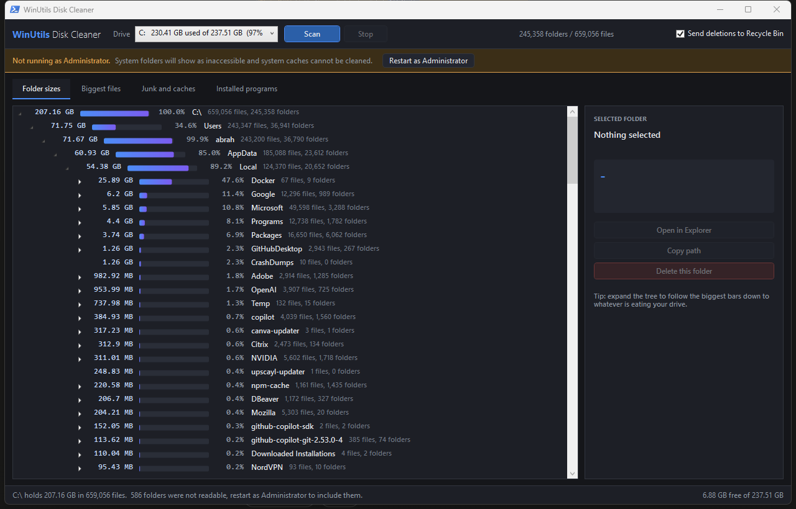

# WinUtils Disk Cleaner

A zero-install Windows desktop utility that scans a drive, shows you exactly which
folders and files are eating your space, and helps you reclaim it by clearing caches
and uninstalling programs you don't need.

No installer, no dependencies, no .NET SDK required. It's a PowerShell + WPF app with
a native scan engine that compiles itself on first run.



## Running it

Double-click **`DiskCleaner.bat`**.

Or, to include protected system folders (`C:\Windows\Temp`, the Windows Update cache,
`Windows.old`, other users' profiles), double-click **`DiskCleaner-Admin.bat`** and accept
the UAC prompt. You can also switch to elevated mode from inside the app using the
**Restart as Administrator** button in the yellow banner.

You can also run it directly:

```
powershell -NoProfile -ExecutionPolicy Bypass -STA -File src\DiskCleaner.ps1
```

**Requirements:** Windows 10/11 with Windows PowerShell 5.1 (built in). Nothing else.

The first launch takes a few extra seconds while the scan engine is compiled and cached
to `%LOCALAPPDATA%\WinUtils\bin\`. Later launches are instant.

## What each tab does

### Folder sizes

Press **Scan** and it walks the whole drive, then shows a tree sorted biggest-first with
a bar for each folder's share of its parent. The path down to the largest folder is
auto-expanded, so the thing eating your drive is on screen the moment the scan finishes.

Keep expanding the biggest bar and you'll land on the culprit in a few clicks. Select any
folder to open it in Explorer, copy its path, or delete it.

A full 230 GB drive with ~660,000 files scans in about a minute. The scan runs in parallel
across CPU cores using `FindFirstFileEx`, and the UI stays responsive throughout — you can
press **Stop** at any time.

### Biggest files

Every individual file of 50 MB or more found during the scan, largest first, with the
folder it lives in and its last-modified date. This is where forgotten ISOs, VM disks,
old installers and stale downloads turn up. There's a filter box for narrowing by name
or path, and you can select multiple rows and delete them in one go.

### Junk and caches

A curated catalog of ~27 known-safe cleanup locations, each measured on your actual machine
so you see real numbers before you decide. Every row explains what it is and what happens
if you delete it.

Rows are tagged with a risk level:

| Risk | Meaning |
| --- | --- |
| **Safe** | Regenerated automatically. Pre-ticked for you. Temp files, browser caches, crash dumps, thumbnail cache, servicing logs, leftover installer payloads. |
| **Review** | Fine to delete but has a cost — Prefetch makes the next app launch slightly slower, `Windows.old` removes your ability to roll back a Windows upgrade, package caches mean re-downloading. Not pre-ticked. |
| **Info** | Not deleted by this tool, listed so you know where the space went. `pagefile.sys`, `hiberfil.sys`, WinSxS, your Downloads folder. Each row tells you the correct way to deal with it. |

Press **Clean selected** and you get a confirmation listing exactly what will go and how
much it should free.

### Installed programs

Everything registered as installed, sorted by size, with publisher, version and install
date. Press **Measure real sizes** to measure each program's install folder on disk rather
than trusting the size the installer registered — the registry number is often missing or
wrong. Select programs and press **Uninstall selected** to run their uninstallers one after
another.

## Deleting: Recycle Bin vs permanent

The **Send deletions to Recycle Bin** checkbox in the top-right controls deletions from the
**Folder sizes** and **Biggest files** tabs. Leave it ticked and anything you delete is
recoverable.

**Junk cleaning is always permanent.** Moving a cache into the Recycle Bin wouldn't actually
free any space until you emptied the bin, which would be misleading. The confirmation dialog
says so explicitly.

Every delete reports the space actually reclaimed by measuring before and after, so if some
files were locked by a running program you'll see the true number rather than an optimistic one.

## Notes on accuracy

- Sizes are real bytes on disk from the filesystem, verified byte-for-byte against
  `Get-ChildItem -Recurse`.
- Junctions and symlinks are skipped rather than followed, so nothing is double-counted and
  the scan can't loop forever.
- Long paths beyond `MAX_PATH` are handled.
- Folders that can't be read are counted and reported in the status bar rather than silently
  ignored. If you see a large number there, rerun as Administrator.

## Safety

- Nothing is deleted without an explicit confirmation dialog naming what will be removed.
- The junk catalog is a fixed allowlist of specific paths. It never deletes by pattern-matching
  across your drive.
- Your documents, photos, browser history, saved passwords and bookmarks are never touched.
  Browser cleanup covers cache only.
- `Info` rows are display-only and cannot be deleted by the tool at all.

## Layout

```
DiskCleaner.bat          Launcher
DiskCleaner-Admin.bat    Elevated launcher
src/
  DiskCleaner.ps1        Application: UI wiring, background jobs, all tab logic
  MainWindow.xaml        Window layout and dark theme
  Cleanup.ps1            Junk catalog + installed-program enumeration
  Scanner.cs             Native scan / measure / delete engine, compiled at runtime
```
